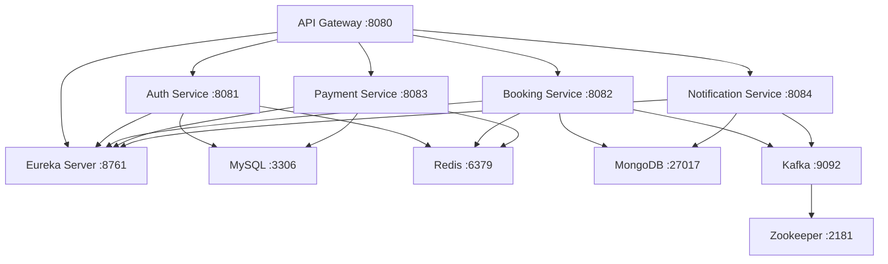

# 🐳 Docker Setup Summary - Booking Platform Microservices

## ✅ Completed Components

### 1. Dockerfiles Created
- **eureka-server/Dockerfile** - Service Discovery
- **auth-service/Dockerfile** - Authentication Service  
- **booking-service/Dockerfile** - Booking Management
- **payment-service/Dockerfile** - Payment Processing
- **notification-service/Dockerfile** - Notifications
- **api-gateway/Dockerfile** - API Gateway

### 2. Docker Compose Configuration
- **docker-compose.yml** - Complete orchestration file with:
  - Infrastructure services (MySQL, MongoDB, Redis, Kafka, Zookeeper)
  - All microservices with proper dependencies
  - Health checks and networking
  - Environment variables configuration

### 3. Supporting Files
- **.dockerignore** - Optimized build contexts
- **docker/mysql/init.sql** - Database initialization
- **docker/README.md** - Detailed documentation
- **docker/start.sh** - Helper startup script

## 🏗️ Architecture Features

### Multi-Stage Builds
Each service uses optimized multi-stage builds:
```dockerfile
# Build stage
FROM eclipse-temurin:21-jdk-alpine AS builder
WORKDIR /app
RUN apk add --no-cache maven
COPY . .
RUN mvn clean install -DskipTests -pl common-library,<service> -am

# Runtime stage  
FROM eclipse-temurin:21-jre-alpine
RUN apk add --no-cache curl
# ... minimal runtime setup
```

### Security Best Practices
- Non-root users for all containers
- Minimal Alpine-based images
- Health checks for monitoring
- Secure inter-service communication

### Dependency Management
- Common library built first for all services
- Proper Maven module dependencies (-am flag)
- Build context from repository root

## 🚀 Usage Instructions

### Quick Start
```bash
# Clone repository
git clone https://github.com/nguyen-tuankiet/booking-platform.git
cd booking-platform

# Start all services
docker-compose up --build

# Or use the helper script
chmod +x docker/start.sh
./docker/start.sh
```

### Step-by-Step Startup
```bash
# 1. Start infrastructure
docker-compose up -d mysql mongodb redis zookeeper kafka

# 2. Wait for infrastructure to be ready (30-60 seconds)
docker-compose ps

# 3. Start Eureka Server
docker-compose up -d eureka-server

# 4. Start microservices
docker-compose up -d auth-service booking-service payment-service notification-service

# 5. Start API Gateway
docker-compose up -d api-gateway
```

### Access URLs
- **Eureka Dashboard**: http://localhost:8761
- **API Gateway**: http://localhost:8080
- **Auth Service**: http://localhost:8081
- **Booking Service**: http://localhost:8082
- **Payment Service**: http://localhost:8083
- **Notification Service**: http://localhost:8084

## 📊 Service Dependencies



## 🔧 Configuration

### Environment Variables
- **SPRING_PROFILES_ACTIVE**: docker
- **Database URLs**: Configured for container networking
- **Eureka URL**: http://eureka-server:8761/eureka/
- **Kafka Bootstrap**: kafka:29092

### Volumes & Persistence
- mysql_data: MySQL database files
- mongodb_data: MongoDB database files
- redis_data: Redis persistence
- kafka_data: Kafka logs
- zookeeper_data: Zookeeper data

## 🐛 Troubleshooting

### Common Issues
1. **Build Failures**: Ensure Docker has enough memory (4GB+)
2. **Service Won't Start**: Check dependencies are healthy first
3. **Connection Refused**: Verify service registration with Eureka
4. **Port Conflicts**: Modify port mappings in docker-compose.yml

### Debugging Commands
```bash
# Check all container status
docker-compose ps

# View logs
docker-compose logs -f [service-name]

# Check health endpoints
curl http://localhost:8761/actuator/health

# Restart specific service
docker-compose restart auth-service

# Clean rebuild
docker-compose down -v
docker-compose build --no-cache
docker-compose up
```

## 📈 Next Steps

1. **Production Setup**: Use external databases and configure secrets
2. **Monitoring**: Add Prometheus/Grafana stack
3. **CI/CD**: Integrate with GitHub Actions for automated builds
4. **Scaling**: Configure horizontal scaling for stateless services
5. **Security**: Add HTTPS termination and API authentication

---

> **Note**: This Docker setup provides a complete development environment. For production deployment, additional considerations for security, scaling, and monitoring should be implemented.